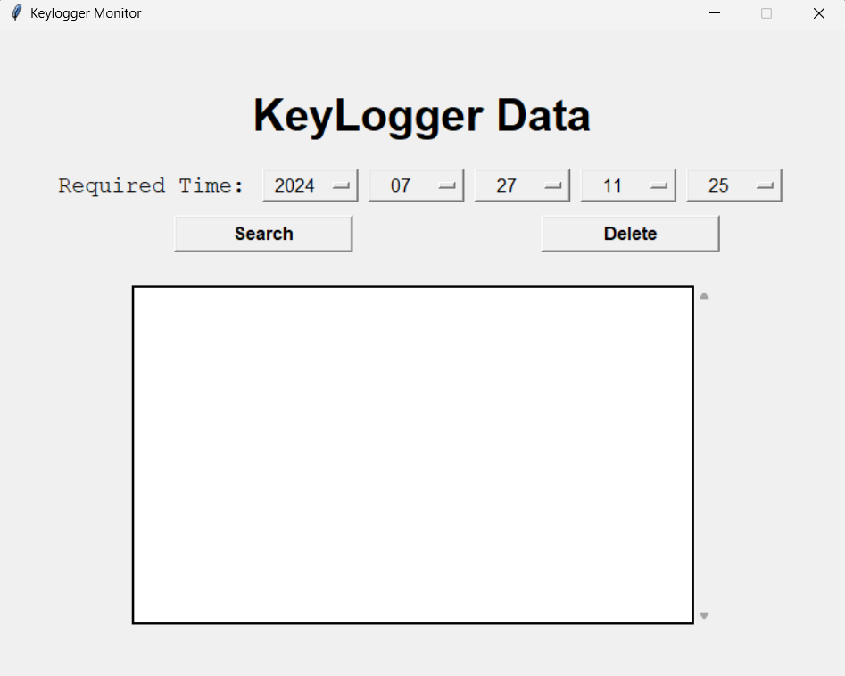

# Keylogger Monitor GUI

## 📜 Overview

The **Keylogger Monitor GUI** is a Python-based application designed to help users manage and view keylogger data through a user-friendly graphical interface. Built with Tkinter, this tool allows for efficient data retrieval and management based on timestamps.

## 🎨 Features

- **View Keylogger Data**: Search and display keylogger events based on selected date and time.
- **Delete Keylogger Data**: Remove data associated with specific timestamps.
- **Scrollable Canvas**: Navigate through large amounts of data with vertical and horizontal scrollbars.

## 🖼 Screenshot

## 📦 Requirements

- Python 3.x
- Tkinter (usually included with Python standard libraries)
- `json` module (included with Python standard libraries)
- `os` module (included with Python standard libraries)

## 🚀 Installation

1. **Clone the repository:**
   bash
   git clone https://github.com/sushanshetty1/Keylogger-Monitor-GUI.git
   

2. **Navigate to the project directory:**
   bash
   cd Keylogger-Monitor-GUI
   

3. **Ensure you have Python 3 installed.** Tkinter and other required modules are included with Python.

## 💻 Usage

1. **Run the application:**
   bash
   python gui.py
   

2. **Interface Components:**
   - **Title Label**: Displays the name of the application.
   - **Time Label**: Indicates the format for date and time input.
   - **Date and Time Selector**: Choose the year, month, day, hour, and minute.
   - **Search Button**: Search and display keylogger events for the selected timestamp.
   - **Delete Button**: Delete keylogger data associated with the current timestamp.
   - **Scrollable Canvas**: View and scroll through keylogger data.

## 📝 Example

To **search for keylogger data**:
1. Select the desired date and time from the dropdown menus.
2. Click the **"Search"** button.

To **delete keylogger data**:
1. Click the **"Delete"** button to remove data for the current timestamp.

## ⚠ Warning

This project is for educational purposes only. Using keyloggers without proper authorization or consent is illegal and unethical. Ensure you have permission before using or deploying any keylogging tools.

## 🤝 Contributing

Contributions are welcome! If you encounter any issues or have feature suggestions, please open an issue or submit a pull request.

## 📝 License

This project is licensed under the MIT License - see the [LICENSE](LICENSE) file for details.

## 📫 Contact

For any questions or support, please reach out to [sushanshetty1470@gmail.com](mailto:sushanshetty1470@gmail.com).
